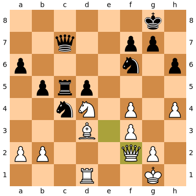

lc0_analyzer.py takes pgn files or FEN strings, analyzes them with the Lc0 chess engine, and outputs some graphs to visualize Lc0's search. For each position, several graphs are created:
* Value vs Total Nodes - Shows how the value of the moves change over time (Total Nodes searched).
* Value vs Child Node Visits - Show how the value of the top moves change, but assuming equal time (Child Node Visits) is given to each candidate move.
* Child Node Visits vs Total Nodes - Shows how much total time (visits) each move is searched.
* Policy - Output of Lc0's NN Policy head.

Black to play

 

After ??? nodes, Lc0 realizes ??? loses.

 

If Lc0 had searched ??? earlier it would have noticed right away that it loses.

Once Lc0 finds the winning move, it quickly gets all the search time.

Also a giant image of all positions is created:

